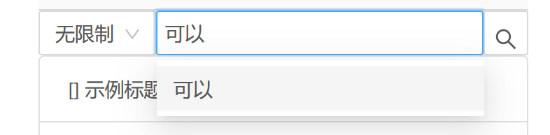
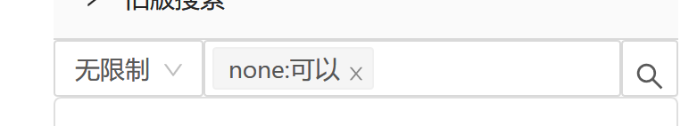
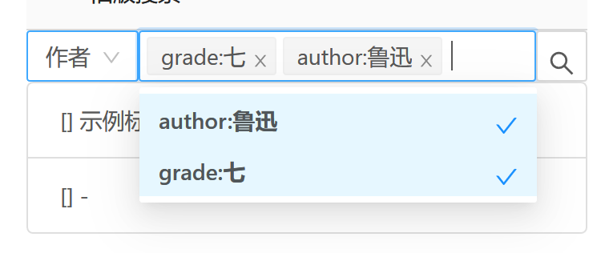
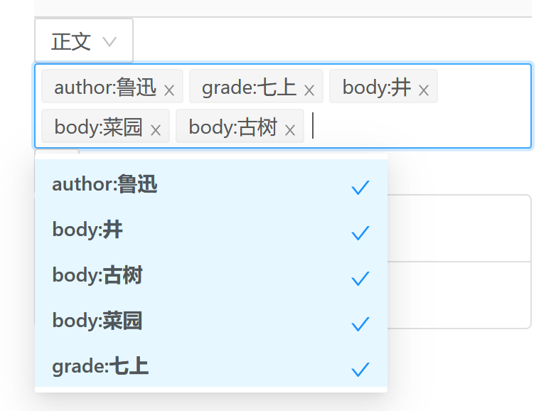

# 用户手册

> 注意：该文档对应 v0.1.x版本服务端

## 普通用户

#### 访问服务

1. 打开任意浏览器
2. 在网址栏输入管理员提供的url ,应该像这样`http://192.168.0.1:8080`、`192.168.0.1:8080`、`192.168.0.1`、`http://demo.com`等即可

#### 使用搜索框

* 条件查找
   1. 查找任何带有“可以”的文档
   
      1. 在“无限制”模式下，输入“可以”，按回车键或者点击下方可以字段加入无限制搜索框
   
      
   
      
   
   2. 搜索年级是七年级的鲁迅的文档
   
      
   
   3.  搜索七上所有内容，作者为鲁迅，正文含有“井”，“菜园”，“古树”之一的文档
   
      

#### 遇到其他问题

请先联系管理员如仍有问题请参阅[上述列表中没有我的问题](#上述列表中没有我的问题)联系我们


##  管理员

### 安装
* [服务软件下载](https://github.com/HanyuuLu/koroneLib/releases)
### 运行方法
1. 根据操作系统选择对应的release包
2. 解压
3. 运行
  * Windows
    双击运行KoroneServer.exe
  * Linux
    bash运行
    
      ``` bash
        ./KoroneServer
      ```
    > 如果提示权限不足无法运行请使用chmod给KoroneServer赋予运行权限
  * macOS 
    命令行运行 KoroneServer
### 常见问题
#### 数据文件在哪
  运行软件的根目录的Lib文件夹下
#### 报错`address already in use.`或`通常每个套接字地址(协议/网络地址/端口)只允许使用一次`
  您的端口可能已被其他软件占用或者重复开启服务端，请检查端口占用情况，如果要更改端口，请参考 [更换运行端口](#如何更换监听端口)
#### 报错`File already in use`
  请检查是否已经有服务端正在运行，这种情况往往是尝试多开导致的，如果有多开需求请**复制一份**并**更换端口**运行
#### 如何更换监听端口
  在软件根目录的`appsettings.json`文件中
  ``` json
  {
  "Logging": {
    "LogLevel": {
      "Default": "Information",
      "Microsoft": "Warning",
      "Microsoft.Hosting.Lifetime": "Information"
    }
  },
  "AllowedHosts": "*",
  "urls": "http://*:35353", //此处配置端口和url
  "LibFolder": "./Library"
}
  ```
#### 打开hostname:[port]页面空白（不是反馈网络连接错误）

可能是在不正确的路径中开启了进程或者误删根目录下的`wwwroot`目录下的文件，请在根目录下运行或者重新[下载](#安装)服务程序
#### 能在本地机器中访问`localhost:[port]`访问到但是其他机器上访问不到或者全部访问不到
  请按照如下顺序检查
  1. 检查进程是否存活
  * windows
      按Ctrl+Shift+Delete，在任务管理器中检查是否有`KoroneServer.exe`进程，若无请启动进程
  * Linux & macOS
 运行`ps -ef | grep KoroneServer` 检查是否有`KoroneServer.exe`进程，若无请启动进程
2. 打开`hostname:[port]`页面空白（不是反馈网络连接错误
 参阅[打开hostname:[port]页面空白](#打开hostname:[port]页面空白（不是反馈网络连接错误）)
3. 是否在全网段监听
 检查`appsettings.json`,请将url参数的域名部分设置为 `*`或者`0.0.0.0`\
 例如 `"urls": "http://*:8080"`
4. 检查防火墙
 - windows
   参阅[打开或关闭 Microsoft Defender 防火墙](https://support.microsoft.com/zh-cn/help/4028544/windows-10-turn-microsoft-defender-firewall-on-or-off)
 - Linux & macOS
   请参阅防火墙相关文档

 放行对应**端口**或**程序**即可，**不推荐关闭防火墙**
5. 是否在同一个网段下
 请检查是否在同一个网络下或者域名是否有效或者网络开启了AP隔离等安全措施，详细请联系您的网络服务提供商或技术支持人员

#### 上述列表中没有我的问题

 请在[GitHub](https://github.com/HanyuuLu/koroneLib/issues)中向我提issue，或者向我[发邮件](mailto:HanyuuFurude@outlook.com) 